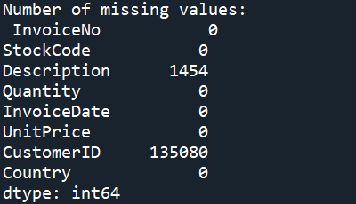

# Using K-Means Clustering for Customer Segmentation

## About

A marketing department are looking to refine their advertising campaigns. In order to do this they would like to segment their existing consumer base. The department could manually construct customer segments but would like a reproducible method for future campaigns.

In this project we will create an unsupervised machine learning algorithm in Python to segment customers. Creating a K-Means Clustering algorithm to group customers by commonalities and provide the marketing department with insights into the different types of customers they have.

Skills Showcased:

-   Unsupervised Machine Learning - K-Means Clustering
-   Data Cleaning
-   Feature Engineering
-   Data Analysis

[View more projects like this!](https://cian-murray-doyle.github.io/)

## Libraries Overview

The following Python libraries will be used for this project.

``` python
import numpy as np
import pandas as pd
import seaborn as sns
from sklearn.cluster import KMeans
from sklearn.preprocessing import StandardScaler
import matplotlib.pyplot as plt
```

If these libraries are not installed, they can be installed with the following code.

``` python
# Install NumPy
!pip install numpy

# Install Pandas
!pip install pandas

# Install Seaborn
!pip install seaborn

# Install scikit-learn (includes KMeans)
!pip install scikit-learn

# Install Matplotlib
!pip install matplotlib
```

## Cleaning the Data

Before any algorithms are applied, the dataset needs to be cleaned.




